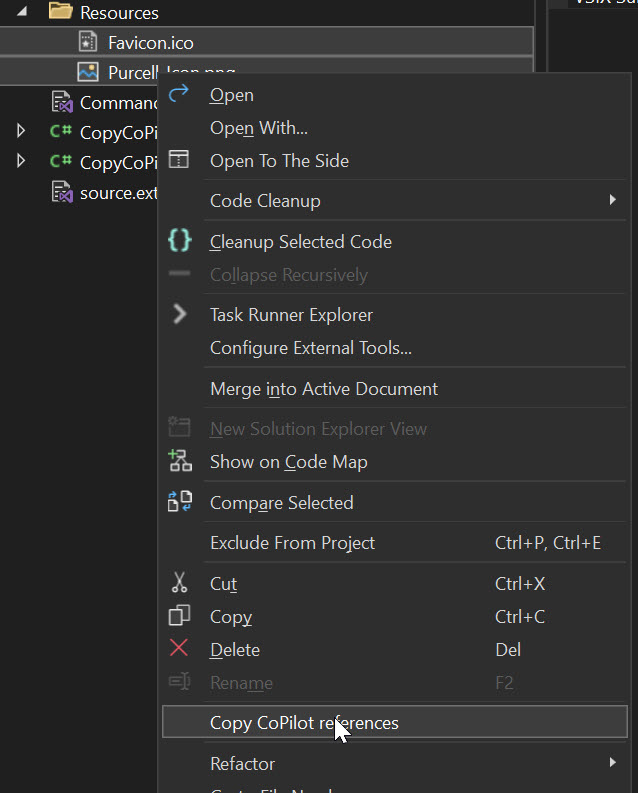

# Copy CoPilot References Extension

This Visual Studio extension simplifies referencing files in GitHub Copilot Chat by copying their relative paths to the clipboard, formatted for immediate use.

## How to Use

1.  In the **Solution Explorer**, select one or more files.
2.  Right-click the selected file(s) to open the context menu.
3.  Click on **"Copy CoPilot references"**.
4.  The formatted references (e.g., `#file:'YourProject/YourFile.cs'`) are now on your clipboard.
5.  Paste the text directly into the GitHub Copilot Chat window.

## Features

*   **Single & Multi-file Selection**: Copy references for one or multiple files at once.
*   **Correct Formatting**: Automatically formats the paths with the `#file:'...'` syntax required by Copilot Chat.
*   **Relative Paths**: Generates paths relative to the solution directory for cleaner references.
*   **Easy Access**: Integrates directly into the Solution Explorer item context menu for a seamless workflow.